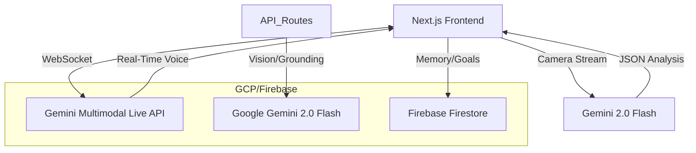

# SentiLens: Real-Time Assistive Vision

SentiLens is a real-time assistive application designed to help visually impaired individuals navigate and understand their environment. Powered by **Google Gemini 2.0 Flash** and the **Gemini Multimodal Live API**, it provides a low-latency, voice-first interface for grocery shopping, document reading, medication safety, and general environmental awareness.

## Architecture & Integration



- **Client-Side:** Next.js application capturing video frames and audio.
- **Real-Time Pipeline:** Direct WebSocket connection to the Gemini Multimodal Live API.
- **Vision:** Gemini 2.0 Flash handles OCR and scene reasoning via high-performance multimodal endpoints.
- **Grounding:** Function Calling (Tools) allows the AI to verify facts against external databases.
- **Memory:** Firestore stores persistent user context and environmental knowledge.

## Features

- **Grocery Assistant:** Identifies products and prices in real-time.
- **Document Interpreter:** Reads, summarizes, and answers questions about physical documents.
- **Medication Safety:** Validates medication labels against official databases and provides safety warnings.
- **Environmental Awareness:** Proactively identifies safety-critical objects and scene changes.

## Prerequisites

- [Google Cloud Project](https://console.cloud.google.com/) or [Google AI Studio](https://aistudio.google.com/) account.
- **API Key** with access to Gemini 2.0 Flash and the Multimodal Live API.
- [Firebase CLI](https://firebase.google.com/docs/cli) installed and configured.

## Getting Started

1.  **Clone the repository:**
    ```bash
    git clone https://github.com/your-repo/senti-lens.git
    cd senti-lens
    ```

2.  **Configure environment variables:**
    Create a `.env.local` file with your Google AI API key:
    ```
    NEXT_PUBLIC_GEMINI_API_KEY=your_api_key_here
    ```

3.  **Install dependencies:**
    ```bash
    npm install
    ```

4.  **Run the development server:**
    ```bash
    npm run dev
    ```

5.  **Open in your browser:**
    Navigate to `http://localhost:3000`.

## Testing

Run the test suite:
```bash
npm test
```

## License

MIT
