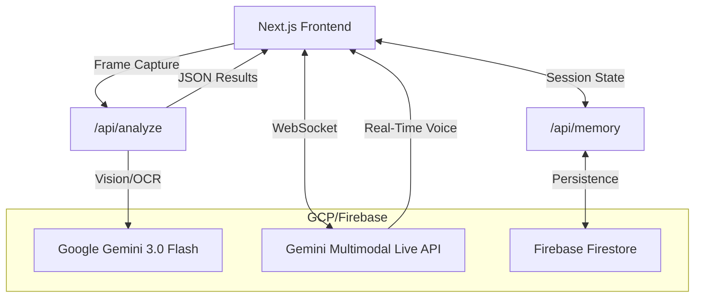

# SentiLens: Real-Time Assistive Vision

SentiLens is a real-time assistive application designed to help visually impaired individuals navigate and understand their environment. Powered by **Google Gemini 3.0 Flash** and the **Gemini Multimodal Live API**, it provides a low-latency, voice-first interface for grocery shopping, document reading, medication safety, and general environmental awareness.

## Architecture & Integration



- **Client-Side:** Next.js application capturing video frames and audio for processing.
- **Real-Time Pipeline:** Direct WebSocket connection to the Gemini Multimodal Live API (using Gemini 2.5 Flash Audio Preview for ultra-low latency).
- **Vision:** Gemini 3.0 Flash handles OCR and scene reasoning via Next.js API routes (`/api/analyze`).
- **Grounding:** Reasoning-based verification. *Note: External database integration for grocery and medical fact-checking is currently simulated/mocked for the MVP.*
- **Memory:** Firebase Firestore stores persistent user context and environmental knowledge, bridged via `/api/memory`.

## Features

- **Grocery Assistant:** Identifies products and prices in real-time.
- **Document Interpreter:** Reads, summarizes, and answers questions about physical documents.
- **Medication Safety:** Validates medication labels against official databases and provides safety warnings.
- **Environmental Awareness:** Proactively identifies safety-critical objects and scene changes.

## Prerequisites

- [Google Cloud Project](https://console.cloud.google.com/) or [Google AI Studio](https://aistudio.google.com/) account.
- **API Key** with access to Gemini 3.0 Flash and the Multimodal Live API.
- [Firebase CLI](https://firebase.google.com/docs/cli) installed and configured.

## Getting Started

1.  **Clone the repository:**
    ```bash
    git clone https://github.com/your-repo/senti-lens.git
    cd senti-lens
    ```

Configuring API keys:
    Create a `.env.local` file with your Google AI API key:
    ```bash
    NEXT_PUBLIC_GOOGLE_API_KEY=your_api_key_here
    ```
    > [!NOTE]
    > The `NEXT_PUBLIC_` prefix is required for the real-time voice feature because it connects directly from the browser. For production, ensure you restrict this key to your browser domain in the Google Cloud Console.

3.  **Install dependencies:**
    ```bash
    npm install
    ```

4.  **Run the development server:**
    ```bash
    npm run dev
    ```

5.  **Open in your browser:**
    Navigate to `http://localhost:3000`.

## Testing

Run the test suite:
```bash
npm test
```

## Deployment

SentiLens is optimized for deployment on **Firebase Hosting**.

### 1. Automated Deployment (Recommended)
The fastest way to deploy is using the included deployment script:

```bash
npm run deploy
```
This script validates your environment, builds the project, and deploys both Hosting and Firestore rules.

### 2. Manual Deployment (Static Export)
If you prefer manual steps:

1.  **Export the project:**
    ```bash
    npm run build
    ```
    *(Ensure `output: 'export'` is set in `next.config.ts` if not already present)*

2.  **Initialize Firebase:**
    ```bash
    firebase login
    firebase init hosting
    ```
    *Select your project and set the public directory to `out`.*

3.  **Deploy:**
    ```bash
    firebase deploy
    ```

### 2. Next.js App Hosting (Recommended for API Routes)
For full SSR and API Route support (required for `/api/analyze`), use the modern Firebase Next.js integration:

1.  **Enable App Hosting:**
    Navigate to the [Firebase Console](https://console.firebase.google.com/) and enable "App Hosting" for your project.

2.  **Connect to GitHub:**
    Follow the setup wizard to connect your repository. Firebase will automatically detect Next.js and handle the build/deploy pipeline.

3.  **Configure Environment Variables:**
    Add your `NEXT_PUBLIC_GOOGLE_API_KEY` in the Firebase App Hosting dashboard.

## Troubleshooting

- **Audio Permission:** Ensure your production domain is served over HTTPS, otherwise microphone access will be blocked by the browser.
- **API Key Restrictions:** In Google Cloud Console, whitelist your deployment domain (e.g., `senti-lens.web.app`) for your Gemini API key.
- **429 Errors:** If you hit rate limits often, consider moving the API calls to a backend service with a dedicated service account rather than using a public-facing API key.

## License

This project is licensed under the MIT License - see the [LICENSE](LICENSE) file for details.
